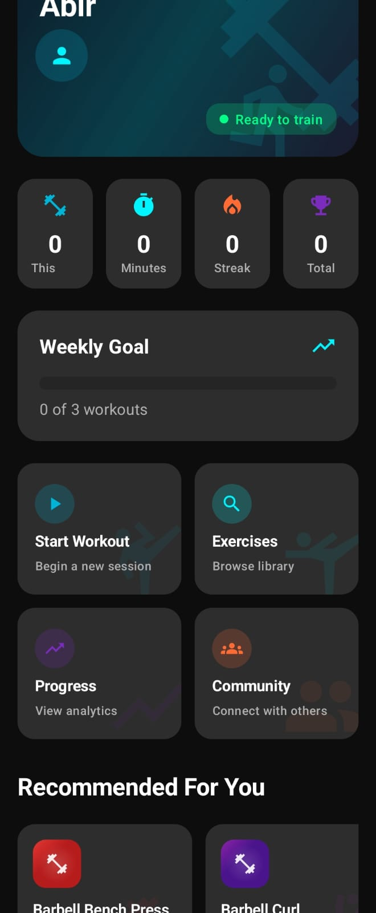
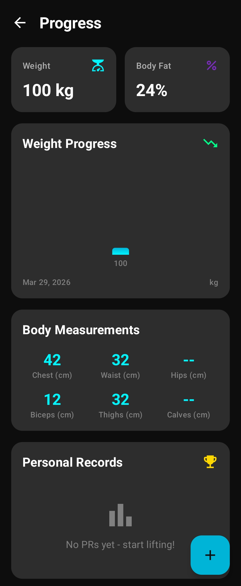

<div align="center">



# GymTrack

### Your Personal Fitness Companion

Track workouts. Monitor progress. Crush goals.

[](https://github.com/Abir7109/GymTrack)
[](https://kotlinlang.org)
[](https://firebase.google.com)
[](https://m3.material.io)
[](LICENSE)

</div>

---

## About

GymTrack is a modern, offline-first fitness tracking app built with Kotlin and Jetpack Compose. Log workouts, track progress with beautiful charts, calculate your 1RM, and never miss a set with the built-in rest timer.

No ads. No sign-up. No BS.

---

## Features

- **Workout Logging** — Log sets, reps, and weight with a fast, intuitive interface
- **Exercise Library** — Browse exercises with muscle group filters and proper form descriptions
- **Progress Charts** — Visualize your strength gains over time with interactive graphs
- **1RM Calculator** — Estimate your one-rep max using the Epley formula
- **Plate Calculator** — Know exactly which plates to load on the bar
- **Rest Timer** — Configurable countdown timer between sets
- **Dashboard** — Daily overview with calories, duration, and streak tracking
- **Offline First** — Full functionality without an internet connection
- **Dark Theme** — Easy on the eyes, looks great in the gym

---

## Screenshots

<div align="center">

| Dashboard | Workout Library | Progress |
|:---------:|:---------------:|:--------:|
|  |  |  |

</div>

---

## Download

<a href="https://github.com/Abir7109/GymTrack/releases">
  
</a>

Requires Android 7.0 (API 24) or higher.

---

## Build from Source

```bash
git clone https://github.com/Abir7109/GymTrack.git
cd GymTrack
```

Open the project in [Android Studio](https://developer.android.com/studio) and sync Gradle. Run on an emulator or physical device.

---

## Tech Stack

| Layer | Technology |
|-------|-----------|
| Language | Kotlin |
| UI | Jetpack Compose + Material 3 |
| Architecture | MVVM + Clean Architecture |
| DI | Dagger Hilt |
| Database | Room |
| Backend | Firebase Firestore |
| Charts | Compose Charts |
| Navigation | Compose Navigation |

---

## Project Structure

```
app/src/main/java/com/gymtrack/app/
├── data/           # Repositories, data sources, models
├── di/             # Hilt dependency injection modules
├── presentation/   # UI screens, ViewModels, components
│   ├── components/ # Reusable Compose components
│   └── screens/    # Feature screens
└── GymTrackApp.kt  # Application class
```

---

## License

This project is licensed under the MIT License — see the [LICENSE](LICENSE) file for details.

---

<div align="center">

**[Report Bug](https://github.com/Abir7109/GymTrack/issues)** · **[Request Feature](https://github.com/Abir7109/GymTrack/issues)**

Made with care for fitness enthusiasts.

</div>
