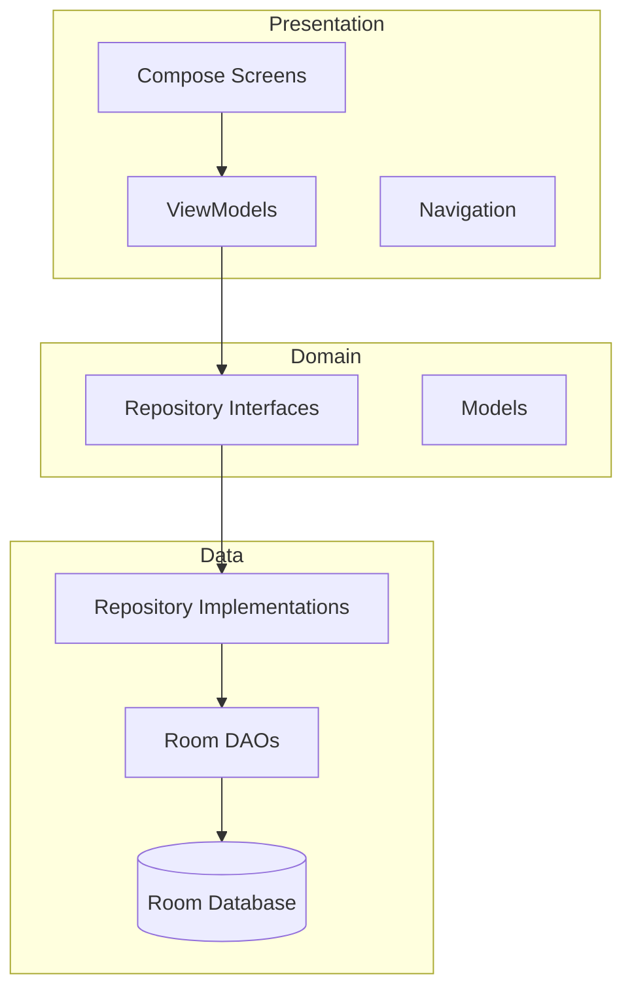

# GymTrack - Fitness Tracking App Description & Roadmap

## 1. App Overview

**GymTrack** is a comprehensive fitness tracking Android application built with Kotlin, Jetpack Compose, and modern Android architecture. It helps users track their workouts, monitor progress, browse exercise libraries, and connect with a fitness community.

---

## 2. Current App Structure

### 📱 Screens (7 Main Screens)

| Screen | Route | Status | Description |
|--------|-------|--------|-------------|
| Onboarding | `/onboarding` | ✅ Working | First-time user setup with profile creation |
| Dashboard | `/dashboard` | ✅ Working | Home screen with stats, quick actions, recent workouts |
| Workout | `/workout` | ⚠️ Partial | Active workout tracking with timer and exercise logging |
| Library | `/library` | ⚠️ Partial | Exercise database with search and filtering |
| Progress | `/progress` | ⚠️ Partial | Body measurements and personal records tracking |
| Community | `/community` | ⚠️ Mock Data | Social features (feed, achievements, challenges, leaderboard) |
| Profile | `/profile` | ⚠️ Partial | User settings and preferences |

### 🔧 Bottom Navigation (6 tabs)
1. **Dashboard** (Home icon)
2. **Workout** (Dumbbell icon)
3. **Library** (Book icon)
4. **Progress** (Trending icon)
5. **Community** (People icon)
6. **Profile** (Person icon)

---

## 3. Data Models

### Core Entities
- **User**: Profile data, preferences, settings
- **Exercise**: Exercise library entry (name, muscle group, equipment, difficulty)
- **Workout**: A workout session with status tracking
- **WorkoutExercise**: Exercise within a workout
- **ExerciseSet**: Individual set with weight, reps, RPE
- **PersonalRecord**: PR tracking per exercise
- **BodyMeasurement**: Weight, body fat, measurements tracking
- **WorkoutTemplate**: Pre-built workout routines

### Enums
- **MuscleGroup**: CHEST, BACK, SHOULDERS, BICEPS, TRICEPS, etc.
- **Equipment**: BARBELL, DUMBBELL, CABLE, MACHINE, BODYWEIGHT, etc.
- **Difficulty**: BEGINNER, INTERMEDIATE, ADVANCED
- **WorkoutStyle**: BODYBUILDING, POWERLIFTING, YOGA, CALISTHENICS, etc.
- **FitnessGoal**: MUSCLE_GAIN, FAT_LOSS, STRENGTH, MAINTENANCE, etc.
- **Gender**: MALE, FEMALE, OTHER, PREFER_NOT_TO_SAY
- **ExperienceLevel**: BEGINNER, INTERMEDIATE, ADVANCED
- **WorkoutStatus**: PLANNED, IN_PROGRESS, COMPLETED, CANCELLED, SKIPPED

---

## 4. Repository Interfaces (6 Repositories)

| Repository | Functions |
|------------|-----------|
| **UserRepository** | getCurrentUser, saveUser, updateUser, markOnboardingCompleted, deleteUser |
| **ExerciseRepository** | getAllExercises, getExercisesByMuscleGroup, getFavoriteExercises, searchExercises, toggleFavorite, seedDefaultExercises |
| **WorkoutRepository** | getAllWorkouts, getActiveWorkout, startWorkout, completeWorkout, getCompletedWorkoutCountSince |
| **WorkoutExerciseRepository** | addExerciseToWorkout, updateWorkoutExercise, removeExerciseFromWorkout |
| **ExerciseSetRepository** | addSet, updateSet, completeSet, deleteSet |
| **PersonalRecordRepository** | getRecordsForExercise, checkAndSaveRecord |
| **BodyMeasurementRepository** | getAllMeasurements, addMeasurement, updateMeasurement |
| **WorkoutTemplateRepository** | getAllTemplates, createTemplate, deleteTemplate |

---

## 5. ViewModels & State Management

| ViewModel | State | Key Functions |
|-----------|-------|---------------|
| **OnboardingViewModel** | user, isLoading | saveUser, completeOnboarding |
| **DashboardViewModel** | user, recentWorkouts, workoutsThisWeek, totalMinutesThisWeek, currentStreak | loadDashboardData, refresh |
| **WorkoutViewModel** | isWorkoutActive, workoutExercises, timerState, availableExercises | startNewWorkout, addExercise, completeSet, finishWorkout |
| **LibraryViewModel** | exercises, filteredExercises, searchQuery, filters | updateSearchQuery, toggleFavorite, filterExercises |
| **ProgressViewModel** | measurements, personalRecords, selectedTimeRange | loadProgressData, addMeasurement, updateTimeRange |
| **ProfileViewModel** | user, settings | updateDarkMode, updateNotifications, updateMeasurementUnit, signOut |
| **CommunityViewModel** | posts, achievements, challenges (all mock data) | likePost, joinChallenge |

---

## 6. Current Functionality Status

### ✅ Working Features
1. **Onboarding Flow**
   - User profile creation (name, DOB, gender, height, weight, experience level)
   - Workout style selection (multi-select)
   - Fitness goal selection
   - Dark mode toggle
   - Onboarding completion tracking

2. **Dashboard**
   - Hero header with user greeting and streak
   - 4-stat cards (workouts this week, minutes, streak, total)
   - Weekly goal progress card
   - Quick action buttons
   - Recent workouts list
   - Tips card

3. **Navigation**
   - Bottom navigation bar with 6 tabs
   - Tab switching with state preservation
   - Navigation to all screens

### ⚠️ Partially Working (Needs Implementation)

1. **Workout Screen**
   - ❌ Exercise picker not fully connected
   - ❌ Save exercises to workout not persisting
   - ❌ Workout completion doesn't save to database properly
   - ✅ Timer functionality works
   - ✅ Add/remove sets works in UI only

2. **Library Screen**
   - ❌ Exercise list not loading from database
   - ❌ Search not working
   - ❌ Filters not working
   - ❌ Favorites toggle not persisting
   - ✅ UI displays exercises (mock data)

3. **Progress Screen**
   - ❌ Weight chart not showing
   - ❌ Body measurements not saving/loading
   - ❌ Personal records not tracking
   - ✅ UI shows measurement input dialog

4. **Profile Screen**
   - ❌ Settings changes not persisting to database
   - ❌ Dark mode toggle doesn't change theme
   - ✅ UI displays settings options
   - ✅ User data displays

5. **Community Screen**
   - ❌ All data is hardcoded (mock)
   - ❌ No backend integration
   - ❌ Posts, achievements, challenges not connected to real user data

### ❌ Missing Features

1. **Database Seeding**
   - No default exercises seeded on first launch

2. **Workout Templates**
   - UI may exist but not connected

3. **Personal Records**
   - Auto-detection and saving not implemented

4. **Body Measurement Tracking**
   - Add measurement dialog exists but doesn't save

5. **Dark Mode**
   - Toggle exists but doesn't actually change app theme

6. **Notifications**
   - Not implemented

7. **Data Persistence Issues**
   - Repository implementations may have gaps

---

## 7. Roadmap - Implementation Priority

### Phase 1: Core Functionality (Critical)
- [ ] 1.1 Fix database seeding for default exercises
- [ ] 1.2 Connect Workout screen to database (start, add exercises, complete)
- [ ] 1.3 Connect Library screen to database (load exercises, search, filter)
- [ ] 1.4 Connect Progress screen to database (measurements, charts)
- [ ] 1.5 Connect Profile settings to database

### Phase 2: Data & Analytics
- [ ] 2.1 Implement Personal Record auto-detection
- [ ] 2.2 Add workout history with details view
- [ ] 2.3 Add body measurement history
- [ ] 2.4 Add progress charts (weight, volume, frequency)

### Phase 3: Features & Polish
- [ ] 3.1 Implement Workout Templates (create, save, use)
- [ ] 3.2 Implement dark mode theme switching
- [ ] 3.3 Add notifications/reminders
- [ ] 3.4 Add rest timer with notifications

### Phase 4: Community (Future)
- [ ] 4.1 Backend integration for community features
- [ ] 4.2 User authentication
- [ ] 4.3 Social features (share workouts, follow users)

---

## 8. Architecture Diagram

---

## 9. Technology Stack

| Component | Technology |
|-----------|------------|
| Language | Kotlin |
| UI Framework | Jetpack Compose |
| DI | Hilt |
| Database | Room |
| Async | Kotlin Coroutines + Flow |
| Navigation | Jetpack Navigation Compose |
| Architecture | MVVM + Clean Architecture |
| Build System | Gradle with KSP |

---

## 10. Next Steps for Implementation

1. **First Priority**: Fix data layer - ensure repositories work correctly
2. **Second Priority**: Connect ViewModels to repositories properly  
3. **Third Priority**: Wire up screens to ViewModels
4. **Fourth Priority**: Add missing features and polish

This roadmap provides a clear path to making all app features functional. Each phase builds upon the previous one, ensuring a solid foundation before adding advanced features.